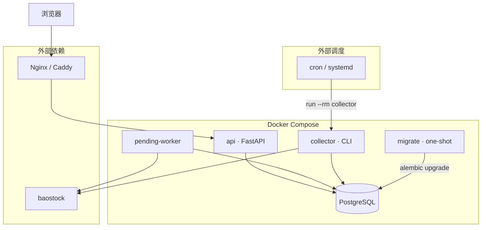
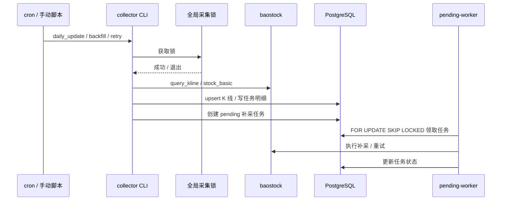

# Trade Data

A 股多周期 K 线数据采集与查询系统。基于 **FastAPI + baostock + PostgreSQL**，提供数据采集 CLI、任务追踪、失败补偿、Session 登录的 Web 管理界面，以及 K 线图表查看。

## 功能概览

- **数据采集**：股票池 / 行业 / 交易日历同步；日 / 周 / 月 K 线历史回填与增量更新
- **复权口径**：不复权、前复权、后复权三套数据分别存储
- **任务系统**：采集任务与明细追踪；失败自动补偿；pending worker 异步执行补采 / 重试
- **质量与停牌**：日线质量检查；基于采集结果推断停牌并记录
- **Web 界面**：登录、仪表盘、K 线图、股票池、行业、任务列表与详情（SSR + Jinja2）
- **JSON API**：前缀 `/api/`，供页面与外部调用（需登录）

### 数据范围

| 项目 | 说明 |
|------|------|
| 数据源 | 仅 baostock |
| 标的 | 上证主板、深证主板、创业板、科创板正常在市股票 |
| 排除 | ETF、基金、债券、北交所、指数、ST/*ST、退市股 |
| 周期 | 日线、周线、月线（默认自 `2020-01-01` 回填） |
| 并发 | 全局单采集锁，同一时间仅一个任务访问 baostock |

## 技术栈

- Python 3.12、FastAPI、SQLAlchemy、Alembic、Pydantic Settings
- PostgreSQL 16、baostock、Typer（CLI）
- Jinja2 SSR、TradingView Lightweight Charts（本地静态资源）
- Docker Compose 部署

## 项目结构

```
trade_data/
├── app/                    # FastAPI 应用
│   ├── api/                # 路由（/api/* 与页面）
│   ├── core/               # 配置、数据库、认证、模板
│   ├── models.py           # SQLAlchemy 模型
│   ├── schemas/            # Pydantic 模型
│   ├── services/           # 查询与命令服务
│   ├── templates/          # Jinja2 页面
│   └── static/             # CSS / JS
├── collector/              # 采集逻辑（baostock、同步、重试、质量检查）
├── scripts/                # CLI 入口与 Compose 辅助脚本
├── migrations/             # Alembic 迁移
├── tests/
├── docker-compose.yml
├── Dockerfile
└── .env.example
```

## 系统架构



### 采集与任务流程



### 部署拓扑

```text
Internet
   │
   ▼
[Nginx/Caddy :443] ──► 127.0.0.1:18080 (api)
                           │
              ┌────────────┼────────────┐
              ▼            ▼            ▼
         pending-worker  postgres    (collector 按需 run)
              │            ▲
              └────────────┘
         trade_data_backend (bridge)
```

## 数据库表

| 表名 | 说明 |
|------|------|
| `stock_master` | 股票主数据（板块、状态、上市/退市日期） |
| `stock_status_history` | 股票状态变更历史 |
| `stock_industry_current` | 当前行业分类 |
| `trade_calendar` | 交易日历 |
| `stock_suspension` | 日线停牌推断记录 |
| `kline_day` / `kline_week` / `kline_month` | 分周期 K 线（含三套复权） |
| `collect_job` | 采集任务 |
| `collect_job_item` | 任务明细（按股票 × 周期 × 复权） |
| `quality_check_result` | 质量检查结果 |

迁移由 Alembic 管理，当前 head revision 为 `002`（外键约束）。查看状态：`alembic current` 或访问 `/health`。

### 任务类型（`job_type`）

| 类型 | 说明 |
|------|------|
| `sync_stock_meta` | 同步股票池 |
| `sync_industry` | 同步行业 |
| `sync_trade_calendar` | 同步交易日历 |
| `backfill_kline` | 历史回填 |
| `daily_update` | 单日日线更新 |
| `catchup_daily_update` | 缺失交易日补齐 |
| `update_weekly` / `update_monthly` | 周 / 月线更新 |
| `retry_failed_jobs` | 批量失败补偿 |
| `manual_retry_failed_job` | 手动重试整个任务 |
| `manual_retry_failed_item` | 手动重试单条明细 |
| `manual_backfill_range` | 页面 / API 手动补采 |

任务状态：`pending` → `running` → `success` / `partial_success` / `failed`；明细另有 `skipped`、`exhausted`、`compensated`。

## 本地开发

### 前置条件

- Python 3.12+
- PostgreSQL（或使用 Compose 仅启动 `postgres`）

### 安装与运行

```bash
python -m venv .venv
source .venv/bin/activate
pip install -r requirements.txt

cp .env.example .env
# 本地开发可将 DATABASE_URL 指向 localhost:5432

alembic upgrade head
uvicorn app.main:app --reload --port 8000
```

默认登录账号见 `.env` 中 `ADMIN_USERNAME` / `ADMIN_PASSWORD`（示例默认为 `admin` / `admin`，**生产环境务必修改**）。

### 测试与 Lint

```bash
pytest tests/ -q
ruff check .
```

## 发布部署（Docker Compose）

推荐在云服务器上使用 Docker Compose 部署。本项目使用独立 Compose 项目名、独立 volume 与 bridge 网络，**不与宿主机上其他 PostgreSQL / Web 服务抢占 5432、80、443**；API 默认只绑定 `127.0.0.1:18080`，由 Nginx / Caddy 反代对外。

### 服务说明

| 服务 | 说明 |
|------|------|
| `postgres` | PostgreSQL 16，数据持久化到命名 volume |
| `migrate` | 一次性任务，执行 `alembic upgrade head` |
| `api` | FastAPI / Uvicorn |
| `pending-worker` | 循环消费 pending 补采 / 重试任务 |
| `collector` | 与上述服务**共享同一镜像**，通过 `docker compose run --rm collector` 执行定时脚本 |

`migrate`、`api`、`collector`、`pending-worker` 共用镜像 `${COMPOSE_PROJECT_NAME}-app`，避免升级后 cron 脚本与 API 代码版本不一致。

### 首次部署

1. 克隆代码，复制并编辑环境变量：

```bash
cp .env.example .env
# 必改：POSTGRES_PASSWORD、SECRET_KEY、ADMIN_PASSWORD
```

2. 确认 `API_HOST_PORT`（默认 `18080`）未被占用。

3. 启动服务（自动跑迁移，再启动 api / pending-worker）：

```bash
docker compose --env-file .env up -d --build
# 或
./scripts/compose_up.sh
```

4. 检查健康状态（需 `database`、`schema`、`migration` 均为 `ok`）：

```bash
curl -s http://127.0.0.1:18080/health | jq .
```

示例响应：

```json
{
  "status": "ok",
  "database": "ok",
  "schema": "ok",
  "migration": "ok",
  "migration_current": "002",
  "migration_expected": "002"
}
```

5. 配置反向代理，将域名转发到 `127.0.0.1:18080`（**勿将 PostgreSQL 暴露到公网**）。

   Nginx 最小示例：

   ```nginx
   server {
       listen 443 ssl;
       server_name trade.example.com;

       # ssl_certificate ...;

       location / {
           proxy_pass http://127.0.0.1:18080;
           proxy_set_header Host $host;
           proxy_set_header X-Real-IP $remote_addr;
           proxy_set_header X-Forwarded-For $proxy_add_x_forwarded_for;
           proxy_set_header X-Forwarded-Proto $scheme;
       }
   }
   ```

6. 初始化数据采集（首次执行一次）：

```bash
docker compose --env-file .env run --rm collector python scripts/sync_trade_calendar.py
docker compose --env-file .env run --rm collector python scripts/sync_stock_meta.py
docker compose --env-file .env run --rm collector python scripts/backfill_kline.py --frequency all --adjust all
docker compose --env-file .env run --rm collector python scripts/daily_update.py
```

### 版本升级

Compose 的 one-shot `migrate` 在首次成功后**不会**在后续 `up` 时自动重跑。升级时必须显式重建镜像并执行迁移：

```bash
git pull
./scripts/compose_upgrade.sh
```

等价手动步骤：

```bash
docker compose --env-file .env build          # 重建共享应用镜像
docker compose --env-file .env run --rm migrate
docker compose --env-file .env up -d --force-recreate api pending-worker
curl -s http://127.0.0.1:18080/health | jq .migration
```

### 定时任务（cron 示例）

pending 任务由常驻 `pending-worker` 消费；采集脚本通过 cron 触发 `collector` 容器执行。

将 `/path/to/trade_data` 替换为实际路径：

```cron
# 交易日盘后：日更（含失败补偿、缺失日 catchup）
0 20 * * 1-5 cd /path/to/trade_data && docker compose --env-file .env run --rm collector python scripts/daily_update.py

# 同步近期交易日历
10 18 * * 1-5 cd /path/to/trade_data && docker compose --env-file .env run --rm collector python scripts/sync_trade_calendar.py

# 周线 / 月线
0 20 * * 5 cd /path/to/trade_data && docker compose --env-file .env run --rm collector python scripts/update_weekly_monthly.py --frequency week
30 20 28-31 * * cd /path/to/trade_data && docker compose --env-file .env run --rm collector python scripts/update_weekly_monthly.py --frequency month

# 失败补偿（日更脚本内也会触发，可按需保留）
0 21 * * 1-5 cd /path/to/trade_data && docker compose --env-file .env run --rm collector python scripts/retry_failed_jobs.py

# 每周同步行业
0 22 * * 5 cd /path/to/trade_data && docker compose --env-file .env run --rm collector python scripts/sync_industry.py
```

### 手动备份

```bash
mkdir -p backups
docker compose --env-file .env exec postgres pg_dump -U trade -d trade_data -Fc -f /tmp/trade_data.dump
docker compose --env-file .env cp postgres:/tmp/trade_data.dump ./backups/trade_data-$(date +%Y%m%d).dump
```

如需从宿主机连接数据库维护，可临时给 `postgres` 服务增加端口映射 `127.0.0.1:${POSTGRES_HOST_PORT:-15432}:5432`。

## Web 页面

| 路径 | 说明 |
|------|------|
| `/login` | 登录（公开） |
| `/` | 仪表盘 |
| `/charts` | K 线图表 |
| `/symbols` | 股票池 |
| `/industries` | 行业 |
| `/jobs` | 任务列表 |
| `/jobs/{id}` | 任务详情（支持明细分页） |

除 `/login`、`/health` 外，页面与 `/api/*` 均需 Session 登录。

## 采集脚本

| 脚本 | 说明 |
|------|------|
| `scripts/sync_stock_meta.py` | 同步股票池 |
| `scripts/sync_industry.py` | 同步行业 |
| `scripts/sync_trade_calendar.py` | 同步交易日历 |
| `scripts/backfill_kline.py` | 历史 K 线回填 |
| `scripts/daily_update.py` | 日线增量（含 catchup、元数据同步） |
| `scripts/update_weekly_monthly.py` | 周 / 月线更新 |
| `scripts/retry_failed_jobs.py` | 批量重试失败明细 |
| `scripts/run_pending_jobs.py` | 消费 pending 任务（worker 内使用） |

`backfill_kline.py` 的 `--frequency` 支持 `day` / `week` / `month` / `all`；`--adjust` 支持 `none` / `forward` / `backward` / `all`。

## API 说明

所有 JSON API 前缀为 `/api`，使用 **Session Cookie** 鉴权（先登录再调用）。登录后也可访问 `/docs` 查看 OpenAPI。

### 端点一览

| 方法 | 路径 | 说明 |
|------|------|------|
| GET | `/health` | 健康检查（公开） |
| POST | `/login` | 登录（表单：`username`、`password`） |
| POST | `/logout` | 退出登录 |
| GET | `/api/symbols` | 股票列表 |
| GET | `/api/industries` | 行业列表 |
| GET | `/api/industries/{name}/symbols` | 行业成分股 |
| GET | `/api/klines/{frequency}` | K 线查询（`frequency`= day/week/month） |
| POST | `/api/klines/backfill` | 创建手动补采任务 |
| GET | `/api/jobs` | 任务列表（`limit` ≤ 200） |
| GET | `/api/jobs/{id}` | 单个任务 |
| GET | `/api/jobs/{id}/items` | 任务明细（`offset` + `limit`，`limit` ≤ 500） |
| POST | `/api/jobs/{id}/retry` | 重试失败任务 |
| POST | `/api/job-items/{id}/retry` | 重试单条明细 |

查询参数说明：

- **symbols**：`board`（`sh_main`/`sz_main`/`chinext`/`star`）、`status`、`keyword`、`include_excluded`
- **klines**：`symbol`、`start`、`end`（必填）、`adjust`（`none`/`forward`/`backward`，默认 `forward`）
- **jobs**：`status`、`job_type`、`limit`
- **retry**：`max_attempts` 范围 1–15，默认 3

### 请求示例（curl）

以下示例假设服务运行在 `http://127.0.0.1:18080`，账号密码以你的 `.env` 为准；若使用 `.env.example` 默认值，则为 `admin` / `change-me`。

```bash
# 1. 登录并保存 Session Cookie
curl -c /tmp/trade_cookies -b /tmp/trade_cookies \
  -X POST "http://127.0.0.1:18080/login" \
  -d "username=admin&password=change-me" \
  -o /dev/null -s -D - | grep -i set-cookie

# 2. 健康检查（无需登录）
curl -s "http://127.0.0.1:18080/health" | jq .

# 3. 查询股票池
curl -s -b /tmp/trade_cookies \
  "http://127.0.0.1:18080/api/symbols?status=active&board=chinext&keyword=宁德" | jq .

# 4. 查询 K 线（日线、前复权）
curl -s -b /tmp/trade_cookies \
  "http://127.0.0.1:18080/api/klines/day?symbol=sz.300750&start=2025-01-01&end=2025-06-30&adjust=forward" | jq .

# 5. 查询行业
curl -s -b /tmp/trade_cookies \
  "http://127.0.0.1:18080/api/industries" | jq .

# 6. 查询任务列表
curl -s -b /tmp/trade_cookies \
  "http://127.0.0.1:18080/api/jobs?status=failed&limit=10" | jq .

# 7. 查询任务明细（分页）
curl -s -b /tmp/trade_cookies \
  "http://127.0.0.1:18080/api/jobs/42/items?status=failed&offset=0&limit=100" | jq .

# 8. 创建手动补采任务
curl -s -b /tmp/trade_cookies \
  -X POST "http://127.0.0.1:18080/api/klines/backfill" \
  -H "Content-Type: application/json" \
  -d '{"symbol":"sh.600519","frequency":"day","start":"2025-06-01","end":"2025-06-10"}' | jq .

# 9. 重试失败任务
curl -s -b /tmp/trade_cookies \
  -X POST "http://127.0.0.1:18080/api/jobs/42/retry" \
  -H "Content-Type: application/json" \
  -d '{"only_failed_items":true,"max_attempts":3}' | jq .

# 10. 重试单条明细
curl -s -b /tmp/trade_cookies \
  -X POST "http://127.0.0.1:18080/api/job-items/1001/retry" \
  -H "Content-Type: application/json" \
  -d '{"max_attempts":3}' | jq .
```

K 线响应示例（字段节选）：

```json
{
  "symbol": "sz.300750",
  "frequency": "day",
  "adjust": "forward",
  "items": [
    {
      "time": "2025-06-03",
      "open": 198.5,
      "high": 201.2,
      "low": 196.8,
      "close": 200.1,
      "volume": 1234567.0,
      "amount": 246800000.0
    }
  ],
  "suspensions": []
}
```

补采 / 重试响应示例：

```json
{
  "job_id": 128,
  "status": "pending",
  "job_type": "manual_backfill_range",
  "symbol": "sh.600519",
  "frequency": "day",
  "start": "2025-06-01",
  "end": "2025-06-10",
  "adjust_flags": ["none", "forward", "backward"]
}
```

未登录访问 API 返回 `401`；参数校验失败返回 `422`；业务错误（如股票不存在）返回 `400` / `404`。

## 主要环境变量

| 变量 | 说明 | 默认 |
|------|------|------|
| `DATABASE_URL` | SQLAlchemy 连接串 | 见 `.env.example` |
| `DEFAULT_HISTORY_START_DATE` | 历史回填起点 | `2020-01-01` |
| `CATCHUP_DAILY_MAX_TRADING_DAYS` | 单次 catchup 最多交易日 | `15` |
| `MANUAL_BACKFILL_MAX_NATURAL_DAYS` | 手动补采最大自然日 | `15` |
| `FAILED_JOB_MAX_ATTEMPTS` | 自动重试上限 | `3` |
| `PENDING_JOB_RUNNER_LIMIT` | worker 每轮领取任务数 | `20` |
| `API_HOST_PORT` | 宿主机 API 端口 | `18080` |
| `SECRET_KEY` | Session 密钥 | **生产必改** |
| `ADMIN_USERNAME` / `ADMIN_PASSWORD` | 登录账号 | **生产必改** |

完整列表见 [`.env.example`](.env.example)。

## 运维提示

- **健康检查**：`/health` 除数据库连通性外，还检查核心表是否存在，以及 Alembic 是否已升级到 head。
- **采集锁**：同时只能有一个脚本持有 baostock 采集锁；第二个脚本会退出并提示。
- **磁盘**：关注 `DISK_USAGE_WARN_PERCENT` / `DISK_USAGE_CRITICAL_PERCENT`；高水位时应暂停大规模回填。
- **安全**：服务不要直接裸露公网；修改默认密码与 `SECRET_KEY`；反代仅转发 API 端口。
- **故障排查**：
  - `/health` 中 `schema=missing_tables` → 检查 migrate 是否成功执行
  - `/health` 中 `migration=behind` → 运行 `docker compose run --rm migrate`
  - 任务长期 `pending` → 确认 `pending-worker` 容器在运行
  - 采集脚本立即退出 → 可能未获得全局采集锁，等待其他脚本结束
  - 页面 401 / 跳转登录 → Session 过期，重新登录

## 常见问题

**Q: 升级代码后 cron 脚本行为异常？**  
A: 执行 `./scripts/compose_upgrade.sh` 重建共享镜像；`collector` 与 `api` 使用同一 `${COMPOSE_PROJECT_NAME}-app` 镜像。

**Q: 停机数天后如何补齐日线？**  
A: `daily_update.py` 会自动检测缺失交易日并创建 `catchup_daily_update` 任务；也可手动运行该脚本。

**Q: 如何只对单只股票补历史数据？**  
A: `docker compose run --rm collector python scripts/backfill_kline.py --symbol sh.600519 --frequency day --adjust all --start-date 2024-01-01 --end-date 2024-12-31`

**Q: 本地开发与 Compose 端口不一致？**  
A: 本地 uvicorn 常用 `8000`；Compose 默认映射 `127.0.0.1:18080`。注意 `.env` 中 `DATABASE_URL` 主机名：Compose 内为 `postgres`，本地为 `localhost`。

## 许可证

本项目为私有数据仓库工具，未单独声明开源许可证。使用 baostock 时请遵守其服务条款。
